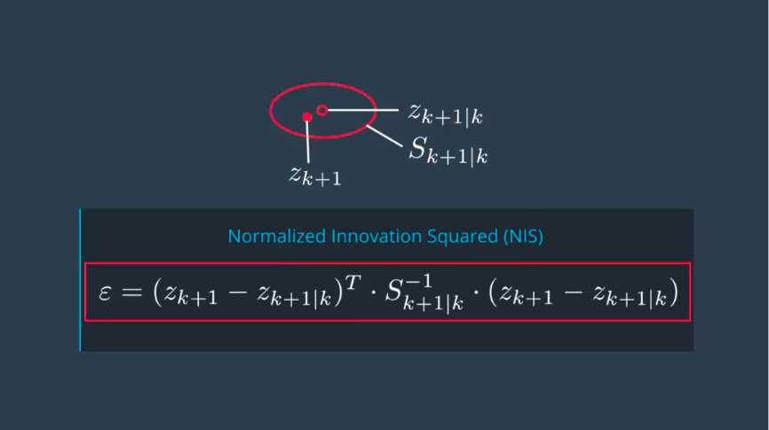
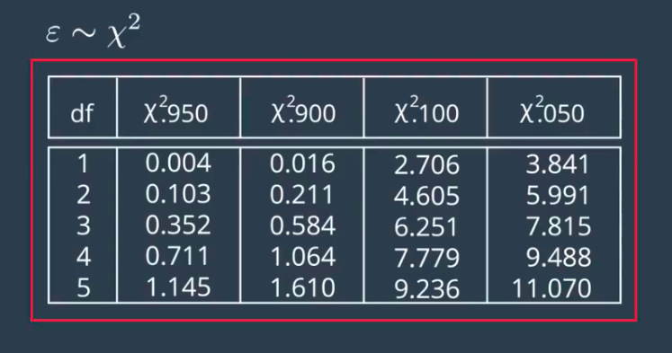
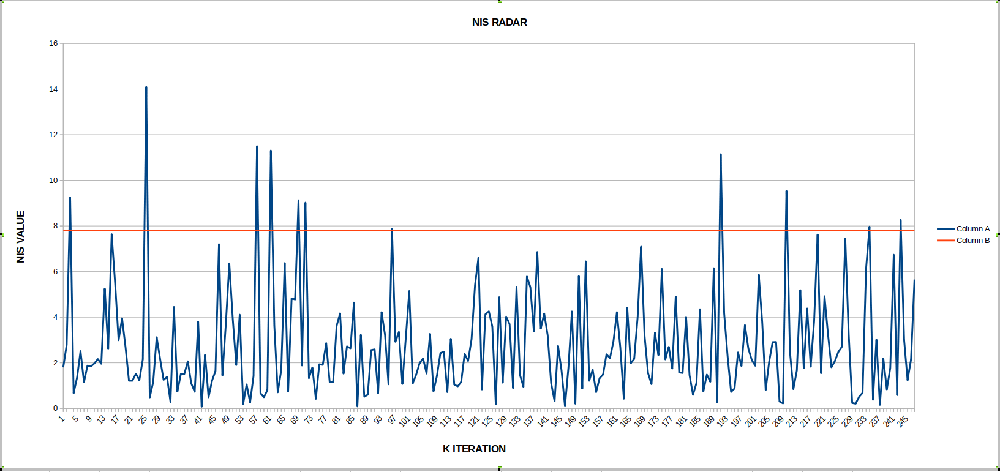

# Unscented-Kalman-FIlter--Car-ND

**Unscented Kalman Filter** works in cycles of Update and Predict steps , the same as Extended Kalman filter. The difference is the manner in which the filter deals with non-linearity in process model. The filter uses representative points called **Sigma Points** which capture the uncertainity . The Sigma points are mapped by the non-linear process model , further they are used to triangulate mean and covariance.

## NIS Consistency Check

Consistency Check provides a measure on how well the given stochastic model describes the actual uncertainity.
  

  

1.**Consistent** 
The model is consistent if it provides a realistic estimation of the uncertainity.
NIS RADAR plot for std_a = 2 ,
std_yawdd = 0.3 ,
degrees of freedom = 3
  

2.**Inconsistent**
* OverEstimated
* UnderEstimated
